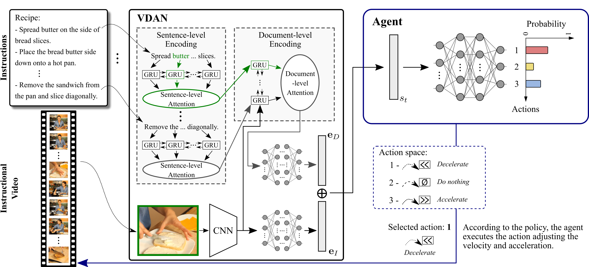
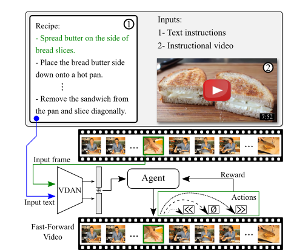
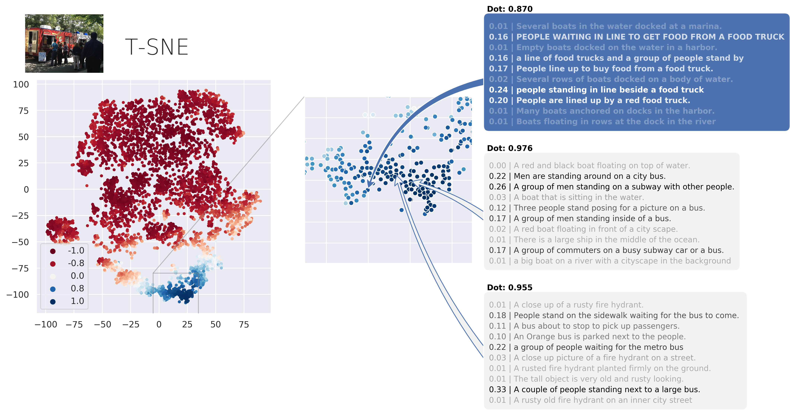
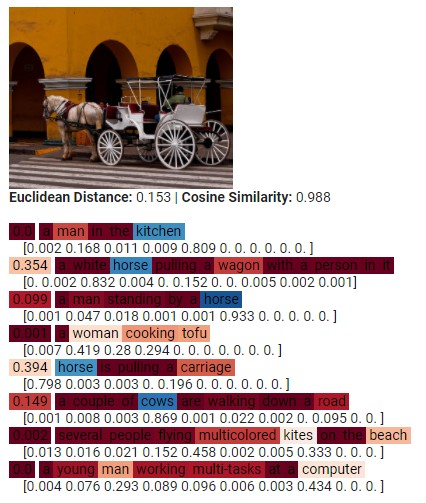

[](LICENSE)
[](https://colab.research.google.com/github/verlab/StraightToThePoint_CVPR_2020/blob/main/StraightToThePoint_CVPR_2020.ipynb)

<b>Straight to the Point: Fast-Forwarding Videos via Reinforcement Learning Using Textual Data</b>
<br>[[Project Page]](https://www.verlab.dcc.ufmg.br/semantic-hyperlapse/cvpr2020) [[Paper]](https://openaccess.thecvf.com/content_CVPR_2020/html/Ramos_Straight_to_the_Point_Fast-Forwarding_Videos_via_Reinforcement_Learning_Using_CVPR_2020_paper.html) [[Video]](https://www.youtube.com/watch?v=v6BNv_00wq4)
===

<!---->
|                                |                               |
|--------------------------------|-------------------------------|
|  |  |


This repository contains the original implementation of the paper **[Straight to the Point: Fast-Forwarding Videos via Reinforcement Learning Using Textual Data](https://doi.org/10.1109/CVPR42600.2020.01094)**, presented at CVPR 2020.

We present a novel methodology based on a reinforcement learning formulation to accelerate instructional videos. An agent is textually and visually oriented to adaptively select frames that are not relevant to convey the information of the original video. Additionally, we propose novel multi-modal network, called Visually-guided Document Attention Network (VDAN), able to generate a highly discriminative embedding space to represent both textual and visual data.

If you find this code useful for your research, please cite the paper:

```
@INPROCEEDINGS{Ramos_2020_CVPR,
  author={W. {Ramos} and M. {Silva} and E. {Araujo} and L. S. {Marcolino} and E. {Nascimento}},
  booktitle={2020 IEEE/CVF Conference on Computer Vision and Pattern Recognition (CVPR)}, 
  title={Straight to the Point: Fast-Forwarding Videos via Reinforcement Learning Using Textual Data}, 
  month = {June},
  year={2020},
  volume={},
  number={},
  pages={10928-10937},
  doi={10.1109/CVPR42600.2020.01094}}
```

---

Usage :computer:
===

Following, we describe different ways to use our code.

PyTorch Hub Model
---

  We provide [PyTorch Hub](https://pytorch.org/docs/stable/hub.html) integration.

  Loading a pretrained model and fast-forwarding your own video is pretty simple!

```python
import torch

model = torch.hub.load('verlab/StraightToThePoint_CVPR_2020:main', 'SemanticFastForward_RL', pretrained=True)
model.cuda()
model.eval()

document = ['sentence_1', 'sentence_2', ..., 'sentence_N'] # Document of N sentences that will guide the agent
sf = model.fast_forward_video('video_filename.mp4', document, 'output_filename.avi') # Returns the selected frames

print('Selected Frames: ', sf)
```


Demos
---

We provide convinient demos in CoLab.

|            **Description**     |  **Link**                     |
|--------------------------------|-------------------------------|
| Process a video using our agent | [](https://colab.research.google.com/github/verlab/StraightToThePoint_CVPR_2020/blob/main/StraightToThePoint_CVPR_2020.ipynb) |
| Train VDAN using MSCOCO | [](https://colab.research.google.com/github/verlab/StraightToThePoint_CVPR_2020/blob/main/demos/train_VDAN.ipynb) |
| Train the agent using YouCook2 | [](https://colab.research.google.com/github/verlab/StraightToThePoint_CVPR_2020/blob/main/demos/train_Agent.ipynb) |
| Extract VDAN feats from a single image | [](https://colab.research.google.com/github/verlab/StraightToThePoint_CVPR_2020/blob/main/demos/bonus.ipynb) |


Data \& Code Preparation
---

If you want to download the code and run it by yourself in your environment, or reproduce our experiments, please follow the next steps:

- ### 1. Make sure you have the requirements

  - [Python](https://www.python.org/) (>=3.6)
  - [PyTorch](https://pytorch.org/) (=1.4.0) # Maybe it works with later versions
<!-- - [torchvision](https://pytorch.org/vision/stable/index.html) (=0.5.0) # Maybe it works in later versions
- [numpy](https://numpy.org/) (>=1.18.2)
- [nltk](https://www.nltk.org/) (>=3.4.5)
- [Pillow](https://pillow.readthedocs.io/en/stable/) (>=7.1.1)
- [pycocotools](https://github.com/cocodataset/cocoapi/tree/master/PythonAPI/pycocotools) (>=2.0)
- [seaborn](https://seaborn.pydata.org/) (>=0.9.0)
- [tqdm](https://tqdm.github.io/) (>=4.45.0)
- [matplotlib](https://matplotlib.org/) (>=3.1.1) -->

- ### 2. Clone the repo and install the dependencies

   ```bash
   git clone https://github.com/verlab/StraightToThePoint_CVPR_2020.git
   cd StraightToThePoint_CVPR_2020
   pip install -r requirements.txt
   ```
<!-- 2. Install COCOAPI:

   ```bash
   pip install cython; pip install -U 'git+https://github.com/cocodataset/cocoapi.git#subdirectory=PythonAPI'
   ``` -->
- ### 3. Prepare the data to train VDAN

  Download \& Organize the [MSCOCO Dataset](https://cocodataset.org/) (Annotations and Images) + Download the Pretrained GloVe Embeddings

   ```bash
   # Download and extract the annotations
   wget -O semantic_encoding/resources/COCO_2017/annotations_trainval2017.zip http://images.cocodataset.org/annotations/annotations_trainval2017.zip
   unzip -j semantic_encoding/resources/COCO_2017/annotations_trainval2017.zip annotations/captions_train2017.json annotations/captions_val2017.json -d semantic_encoding/resources/COCO_2017/annotations/
   rm semantic_encoding/resources/COCO_2017/annotations_trainval2017.zip

   # Download and extract the training images
   wget -O semantic_encoding/resources/COCO_2017/train2017.zip http://images.cocodataset.org/zips/train2017.zip
   unzip -q semantic_encoding/resources/COCO_2017/train2017.zip -d semantic_encoding/resources/COCO_2017/
   rm semantic_encoding/resources/COCO_2017/train2017.zip
   
   # Download and extract the validation images
   wget -O semantic_encoding/resources/COCO_2017/val2017.zip http://images.cocodataset.org/zips/val2017.zip
   unzip -q semantic_encoding/resources/COCO_2017/val2017.zip -d semantic_encoding/resources/COCO_2017/
   rm semantic_encoding/resources/COCO_2017/val2017.zip

   # Download the Pretrained GloVe Embeddings
   wget -O semantic_encoding/resources/glove.6B.zip http://nlp.stanford.edu/data/glove.6B.zip
   unzip -j semantic_encoding/resources/glove.6B.zip glove.6B.300d.txt -d semantic_encoding/resources/
   rm semantic_encoding/resources/glove.6B.zip
   ```

  If you want just to train VDAN, you're now set!

- ### 4. Prepare the data to train the Agent 

  Download \& Organize the [YouCook2 Dataset](http://youcook2.eecs.umich.edu/) (Annotations and Videos)

    ```bash
    # Download and extract the annotations
    wget -O rl_fast_forward/resources/YouCook2/youcookii_annotations_trainval.tar.gz http://youcook2.eecs.umich.edu/static/YouCookII/youcookii_annotations_trainval.tar.gz
    tar -xf rl_fast_forward/resources/YouCook2/youcookii_annotations_trainval.tar.gz -C rl_fast_forward/resources/YouCook2/
    rm rl_fast_forward/resources/YouCook2/youcookii_annotations_trainval.tar.gz
    
    # Download the scripts used to collect the videos
    wget -O rl_fast_forward/resources/YouCook2/scripts.tar.gz http://youcook2.eecs.umich.edu/static/YouCookII/scripts.tar.gz
    tar -xf rl_fast_forward/resources/YouCook2/scripts.tar.gz -C rl_fast_forward/resources/YouCook2/
    rm rl_fast_forward/resources/YouCook2/scripts.tar.gz

    # Install youtube-dl and download the available videos
    pip install youtube_dl
    cd rl_fast_forward/resources/YouCook2/scripts
    python download_youcookii_videos.py
    ```


Training :hourglass_flowing_sand:
---

After running the setup above, you're ready to train the networks.

### Training VDAN
  
To train VDAN, you first need to set up the model and train parameters (current parameters are the same as described in the paper) in the [semantic_encoding/main.py](semantic_encoding/main.py) file, then run the training script.

The training script will save the model in the [semantic_encoding/models](semantic_encoding/models) folder.

  - ### 1. Setup

    ```python
    model_params = {
        'word_embed_size': 300,
        'sent_embed_size': 1024,
        'doc_embed_size': 2048,
        'hidden_feat_size': 512,
        'feat_embed_size': 128,
        'sent_rnn_layers': 1,
        'word_rnn_layers': 1,
        'word_att_size': 1024,  # Same as sent_embed_size
        'sent_att_size': 2048,  # Same as doc_embed_size

        'use_sentence_level_attention': True,
        'use_word_level_attention': True,
        'use_visual_shortcut': True,  # Uses the ResNet-50 output as the first hidden state (h_0) of the document embedder Bi-GRU.
    }

    train_params = {

        ##### Train data files #####

        # COCO 2017 TODO: Download COCO 2017 and set the following folders according to your root for COCO 2017
        'captions_train_fname': 'resources/COCO_2017/annotations/captions_train2017.json',  # TODO: Download the annotation file available at: http://images.cocodataset.org/annotations/annotations_trainval2017.zip
        'captions_val_fname': 'resources/COCO_2017/annotations/captions_val2017.json',  # TODO: Download the nnotation file available at: http://images.cocodataset.org/annotations/annotations_trainval2017.zip
        'train_data_path': 'resources/COCO_2017/train2017/',  # TODO: Download and unzip the folder available at http://images.cocodataset.org/zips/train2017.zip
        'val_data_path': 'resources/COCO_2017/val2017/',  # Download and unzip the folder available at http://images.cocodataset.org/zips/val2017.zip

        'embeddings_filename': 'resources/glove.6B.300d.txt',  # TODO: Download and unzip the file "glove.6B.300d.txt" from the folder "glove.6B" currently available at http://nlp.stanford.edu/data/glove.6B.zip
        'use_fake_embeddings': False,  # Choose if you want to use fake embeddings (Tip: Activate to speed-up debugging) -- It adds random word embeddings, removing the demand of loading the embeddings.

        # Choose how much data you want to use for training and validating (Tip: Use lower values to speed-up debugging)
        'train_data_proportion': 1.,
        'val_data_proportion': 1.,

        # Training parameters (Values for the pretrained model may be different from these values below)
        'max_sents': 10,  # maximum number of sentences per document
        'max_words': 20,  # maximum number of words per sentence

        'train_batch_size': 64,
        'val_batch_size': 64,
        'num_epochs': 30,
        'learning_rate': 1e-5,
        'learning_rate_decay': None,  # We didn't use it in our paper. But, feel free to try ;)
        'decay_at_every': None,  # We didn't use it in our paper. But, feel free to try ;)
        'grad_clip': None,  # clip gradients at this value. We didn't use it in our paper. But, feel free to try ;)
        'finetune_semantic_model': args.model_checkpoint_filename is not None,
        'model_checkpoint_filename': args.model_checkpoint_filename,

        # Image transformation parameters
        'resize_size': 256,
        'random_crop_size': 224,
        'do_random_horizontal_flip': True,

        # Machine and user data
        'username': getpass.getuser(),
        'hostname': socket.gethostname(),

        # Training process
        'optimizer': 'Adam',  # We also tested with SGD -- No improvement over Adam
        'criterion': nn.CosineEmbeddingLoss(0.),

        'checkpoint_folder': 'models',
        'log_folder': 'logs'
    }
    ```

  - ### 2. Train

    First, make sure you have `punkt` installed...

    ```python
    import nltk
    nltk.download('punkt')
    ```

    Finally, you're ready to go! :smiley:

    ```bash
    cd semantic_encoding
    python main.py
    ```

### Training the Agent

  - To train the agent, you will need the features produced the VDAN model. You can have these features [here](https://github.com/verlab/StraightToThePoint_CVPR_2020/releases/download/v1.0.0/youcookii_feats_vdan.zip). To get it via terminal, use:

    ```bash
    # Download YouCook2's VDAN feats
    wget -O resources/YouCook2/VDAN/youcookii_vdan_feats.zip https://github.com/verlab/StraightToThePoint_CVPR_2020/releases/download/v1.0.0/youcookii_feats_vdan.zip
    unzip -q resources/YouCook2/VDAN/youcookii_vdan_feats.zip -d resources/YouCook2/VDAN/
    rm resources/YouCook2/VDAN/youcookii_vdan_feats.zip
    ```
  
  - If you want to extract them by yourself, you can have a VDAN pretrained model by following the instructions in the previous step or downloading a pretrained one we provide [here](https://github.com/verlab/StraightToThePoint_CVPR_2020/releases/download/v1.0.0/vdan_pretrained_model.pth). In terminal, use: 

    ```bash
    # Download the pretrained model
    wget -O semantic_encoding/models/vdan_pretrained_model.pth https://github.com/verlab/StraightToThePoint_CVPR_2020/releases/download/v1.0.0/vdan_pretrained_model.pth
    ```

  - Now, prepare the data for training...

    ```bash
    cd rl_fast_forward
    python resources/create_youcook2_recipe_documents.py
    mkdir resources/YouCook2/VDAN/img_feats
    mkdir resources/YouCook2/VDAN/doc_feats
    ```
  
  - You are set! Now, you just need to run it...

    ```bash
    python main.py -s ../semantic_encoding/models/vdan_model_pretrained.pth -d YouCook2 --include_test
    ```

  - After training, the model will be saved in the [rl_fast_forward/models](rl_fast_forward/models) folder. Then, the script will generate a results JSON file with the pattern `results/<datetime>_<hostname>_youcookii_selected_frames.json`

Evaluating
---

  We provide, in the [rl_fast_forward/eval](rl_fast_forward/eval) folder, a script to evaluate the selected frames generated by the trained agent.

  - To compute Precision, Recall, and F1 Score for your results using the JSON output (generated when training the agent), run the following script:

    ```bash
    cd rl_fast_forward/eval
    python eval_results.py -gt youcookii_gts.json -sf /path/to/the/JSON/output/file.json
    ```

  - It will display the values in your screen and generate a JSON and a CSV output file formatted as: `/path/to/the/JSON/output/file_results.EXT`


Bonus :tada:
---

  We also provide some tools for you to explore our multimodal document-image semantic model (VDAN). There are tools from [qualitatively checking videos in a frame-wise manner](semantic_encoding/_utils/jupyter_notebook_video_player.ipynb) and [generating a t-SNE visualization of the embedding space](semantic_encoding/_utils/tsne_attention_plot.ipynb), to [evaluating the model quantitatively](semantic_encoding/_utils/eval_model.py).

  

  You can also visualize the attention weights distribution in a document given an image:

  ```bash
  cd semantic_encoding
  python extract_vdan_feats.py -m models/vdan_pretrained_model.pth -i resources/example.jpg -u resources/example.txt
  ```

  It will generate an HTML file with your input image and the sentences with the attention distribution below.

  

---


Contact
===

Authors
---

* Washington Ramos - PhD student - UFMG - washington.ramos@dcc.ufmg.br
* Michel Silva - Assistant Professor at Universidade Federal de Viçosa (UFV) - michelms@dcc.ufmg.br
* Edson Araujo - MSc Student - UFMG - edsonroteia@dcc.ufmg.br
* Leandro Soriano Marcolino - Lecturer at Lancaster University - l.marcolino@lancaster.ac.uk
* Erickson R. do Nascimento - Principal Investigator - UFMG - erickson@dcc.ufmg.br

Institution
---

Universidade Federal de Minas Gerais (UFMG)  
Departamento de Ciência da Computação  
Belo Horizonte - Minas Gerais -Brazil 

Laboratory
---

 | 
--- | ---

**VeRLab:** Laboratory of Computer Vison and Robotics   
https://www.verlab.dcc.ufmg.br

---

Acknowledgements
===

We thank the agencies CAPES, CNPq, FAPEMIG, and Petrobras for funding different parts of this work. We also thank NVIDIA Corporation for the donation of a Titan Xp GPU.

### Enjoy it! :smiley:
